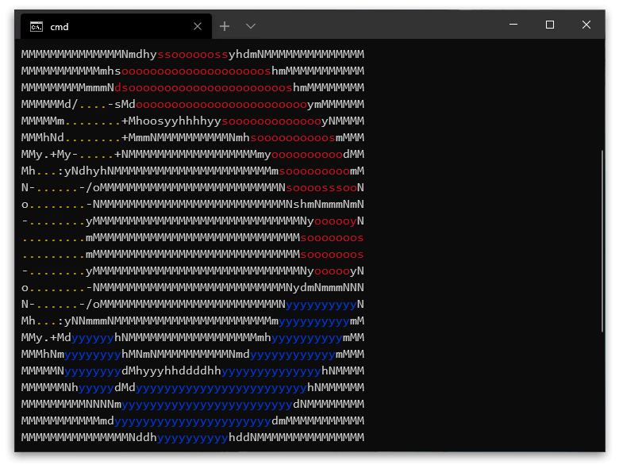

# Art

<div align="center">
    
</div>

> Art in your terminal

## Quick start

### Install with NPM

```
npm i @ionited/art
```

## Usage

Require the package in your Node.js file:

```javascript
const art = require('@ionited/art');
```

### ANSI 8 Colors

Display ANSI 8 Colors (black, red, green, yellow, blue, magenta, cyan, white):

```javascript
art.blue('Hey! I am blue!');
```

### Brighter colors

For brighter color put 'bright' before the color:

```javascript
art.brightRed('Hey! I am brighter red!');
```

### Background colors

For background color put 'bg' before the color:

```javascript
art.bgYellow('Hey! I have yellow background!');
```

Background colors also working with bright prefix:

```javascript
art.bgBrightGreen('Hey! I have brighter green background!');
```

### Modificators

Style your texts with modificators (bold, dim, italic, underline, blink, inverse, invisible, strikethrough):

```javascript
art.bold('Hey! I am a bold text!');
```

---

You can join styles and make art in your terminal:

```javascript
art.bgGreen.bold.yellow('A beatiful message!');
```

### Animations

Make loadings or other animations easily:

```javascript
art.animation(frames: any, infinite?: boolean, fps?: number): void
```

Example:

```javascript
art.animation(['#', '##', '###', '####', '#####']);
```